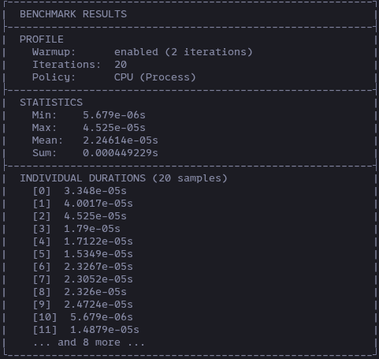

# Benchmarking Documentation

## [Back to Menu](../../README.md#documentation)

## Benchmarking

### runBenchmark()

- Runs benchmark using a [profile](#profile) and both returns and prints a [result object](#result)

```cpp
auto results = runBenchmark(Profile, Callable, Args...);
```



## Profile

- Profile objects are used for managing benchmark settings

```cpp
/** @brief Object used for setting up benchmarks */
struct Profile {
    int64_t warmupIterations{2}; // 2 warmups by default
    int64_t iterations{10}; // 10 iterations
    Policy policy{Policy::CPU_Process}; // Benchmark policy
    bool warmup{true}; // warmup state
};
```

## Result

- Result objects contain the results from the benchmarks

```cpp
class Result{
    std::vector<Duration> m_Durations{};
    Profile m_Profile;
    Duration m_minDuration{time::MAX_DUR};
    Duration m_maxDuration{time::MIN_DUR};
    Duration m_sumDuration{time::DEFAULT_DUR};
    ...

    Duration mean() {...}

    Duration min() {...}

    Duration max() {...}

    Duration sum() {...}

};
```
