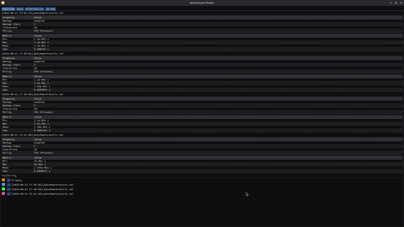
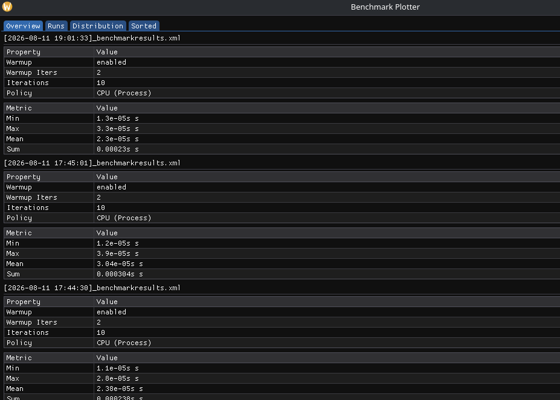

# benchtools

- Simple code benchmarking, analysis, plotting tools for C++(20)



## Content

- [Main Features](#main-features)
  - [Timing](#timing)
  - [Benchmarking](#timing)
  - [Plotting](#timing)
- [How to Setup](#setup)
- [Documentation](#documentation)

## Main Features

### Timing

- Clocks for timing the system, CPU Thread or CPU Process wrapped in a timer

    ```cpp
    using namespace benchtools::timer;
    using namespace benchtools::clock;

    auto timer = Timer<CPUClock<>>{}; // Default is CPU::Process
    auto timer = Timer<CPUClock<CPU::Process>>{}; // Process timer
    auto timer = Timer<CPUClock<CPU::Thread>>{}; // Thread timer
    auto timer = Timer<WallClock>{}; // Wall timer
    ```

- `ScopedTimer` for `scoped_lock` like usage of a timer

    ```cpp
    auto timer = Timer<WallClock>{};
    {
        ScopedTimer scopeLock{timer};
        // ... times this scope
    }
    ```

- `FileTimer` or `LoggingTimer` that logs timer durations and the line, column or the function the timer was started or stopped at. (Example for `LoggingTimer`)

```txt
[2026-08-12 11:56:43.277] [GLOBAL] [trace] /home/t/code/projects/benchmark/src/Test/main.cpp:28:18 int main() Started timer

[2026-08-12 11:56:44.179] [GLOBAL] [trace] /home/t/code/projects/benchmark/src/Test/main.cpp:30 Timer started at: 28:18 int main(), resulted with: 901462665ns
[2026-08-12 11:56:44.179] [GLOBAL] [trace] /home/t/code/projects/benchmark/src/Test/main.cpp:32:18 int main() Started timer

[2026-08-12 11:56:44.767] [GLOBAL] [trace] /home/t/code/projects/benchmark/src/Test/main.cpp:34 Timer started at: 32:18 int main(), resulted with: 587670855ns
[2026-08-12 11:56:44.767] [GLOBAL] [trace] /home/t/code/projects/benchmark/src/Test/main.cpp:36:18 int main() Started timer

[2026-08-12 11:56:45.235] [GLOBAL] [trace] /home/t/code/projects/benchmark/src/Test/main.cpp:38 Timer started at: 36:18 int main(), resulted with: 0n
```

### Benchmarking

- benchmark functions simply by

    ```cpp
    benchmark::Profile profile{ .warmupIterations = 2, .iterations = 20, .policy = benchmark::CPU_Process};
    benchmark::runBenchmark(profile, foo);
    ```

- The results are logged to stdout as well as a `.xml` file


### Plotting

- The library builds a separate executable under `{CMAKE_CURRENT_BINARY_DIR}/bin/` which is the plotter app that reads the `.xml` results of benchmark(s)



- Various details and visualization can be seen in the plotting app

## Setup

- Fetch `benchtools` from GitHub

```cmake
include(FetchContent)

FetchContent_Declare(
    Benchtools
    GIT_REPOSITORY https://github.com/tunariy/benchtools.git
    GIT_TAG v1.1
)

FetchContent_MakeAvailable(Benchtools)
```

- Link with your executable/library

  - Either for timing only

    ```cmake
    add_executable(my_benchmark main.cpp)
    target_link_libraries(my_benchmark PRIVATE
        Benchtools::Timer
        Benchtools::Logger
    )
    ```

  - or Benchmarking as well

    ```cmake
    add_executable(my_benchmark main.cpp)
    target_link_libraries(my_benchmark PRIVATE
        Benchtools::Benchmark
        Benchtools::Timer
        Benchtools::Logger
    )
    ```

- Generate build files and build

```bash
cmake -B build
cmake --build build
```

## Documentation

[Timing](.github/docs/Timing.md)
[Benchmarking](.github/docs/Benchmarking.md)
[Plotting](.github/docs/Plotting.md)
