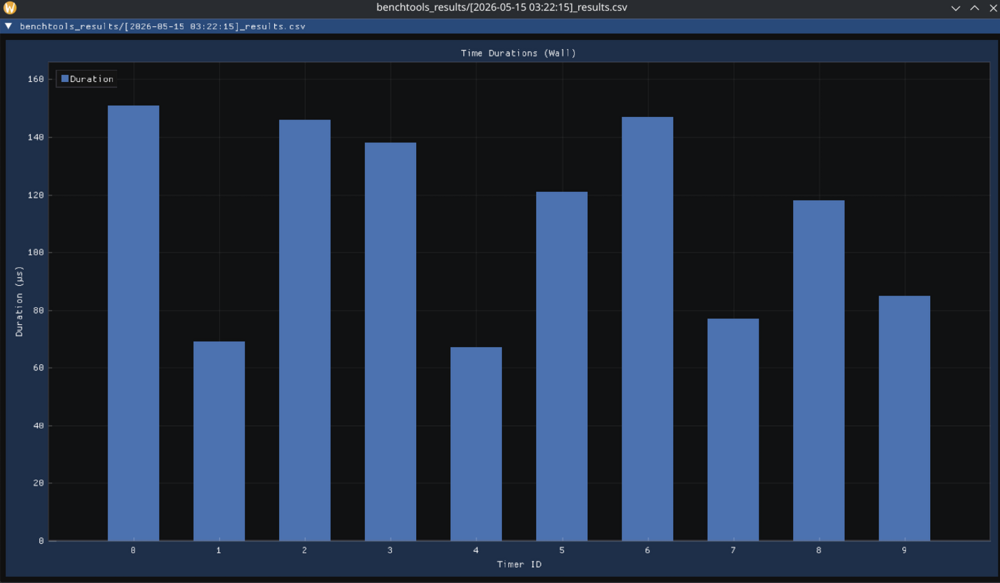

# benchtools

- Simple code benchmarking, analysis, plotting tools for C++(20)

## Menu

- [Features](#features)
- [How to Setup](#how-to-setup)
- [Usage](#how-to-use)
- [Milestones](#milestones)

---

## Features

- Timers for CPU (`ClockTimer`) time or System (`WallTimer`) time
- Each timer type can be wrapped in any wrapper timer type
  - `ScopedTimer` which wraps a timer just like a `scoped_lock`
  - `LoggingTimer` which logs duration after each timer stops
  - `FileTimer` which logs the timer information when the timer starts/stops to a file
- benchmarking with CPU or System time
  - outputs the runtime of each iteration of benchmark to a `.csv`
- Plotting of benchmarking results with **ImPlot**

---

## How to Setup

### CMake

- Add this fetch-content block to your `CMakeLists.txt`

```cmake
include(FetchContent)

FetchContent_Declare(
    Benchtools
    GIT_REPOSITORY https://github.com/tunariy/benchmark.git
    GIT_TAG v1.x.x
)

FetchContent_MakeAvailable(Benchtools)
```

- Then, link Benchtools with your libraries/executables that will use it.

```cmake

add_executable(my_benchmark main.cpp)
target_link_libraries(my_benchmark PRIVATE
    Benchtools::Benchmark   # brings Timers, Core, File, Loggers via transitive deps
)
```

```cmake
add_executable(my_benchmark_app main.cpp)
target_link_libraries(my_benchmark_app PRIVATE
    Benchtools::Timers       # bring Loggers, File modules
)
```

#### For the plotting app

```cmake
add_executable(my_plotter main.cpp)
target_link_libraries(my_plotter PRIVATE
    Benchtools::Plotter
)
```

---

## How to Use

### Library Structure

- 2 base timer types `WallTimer` for system time, `ClockTimer` for CPU time.
- Wrappers for base timer types `ScopedTimer`, `LoggingTimer` etc.
- For logging a `spdlog` wrapper `Logger` and `FileLogger` for file logging
- For `.csv` file handling `CSVStream` and `CSVParser`
- Free `benchmark<Policy>` function for benchmarking a callable function

### Timers

#### WallTimer

- Timer that will time the absolute time, including the system time, between starting and stopping.

```cpp
  WallTimer timer{};
  timer.start();
  // something happens here
  timer.stop();

  std::clog << timer.duration().str();             // default time unit is seconds
  std::clog << timer.duration(milliseconds).str(); // with a different time unit

  timer.reset(); // reset the duration it stores
  timer.reset_if(true); // conditional reset for the duration 
```

#### ClockTimer

- Timer that will time the CPU time between starting and stopping using `clock_t`.

```cpp
  ClockTimer timer{};
  timer.start();
  // something happens here
  timer.stop();

  std::clog << timer.duration().str();             // default time unit is seconds
  std::clog << timer.duration(milliseconds).str(); // with a different time unit

  timer.reset(); // reset the duration it stores
  timer.reset_if(true); // conditional reset for the duration 
```

#### ScopedTimer

- This will wrap `ClockTimer` or `WallTimer` and handle the timing through a scope.

```cpp
  WallTimer timer{};
  {
    ScopedTimer scope_timer(timer);
    // something happens here
  }
  std::clog << timer.duration(seconds).str(); // then get duration in seconds
```

#### FileTimer

- Acts as an interface for the timer, so that when it starts/stops logs the details to a file
- At each call the timer started/stopped at which function, line, column is written

```cpp
  WallTimer timer{};
  FileTimer fileTimer {timer, "log.txt", fileopen::append, time_unit::nanoseconds}
  {
      tim.start();
      // something happens here
      tim.stop();
  }
        // ...
```

Output (example):

```txt
[2026-05-17 01:31:56][INFO] LOGGING SESSION STARTED
[2026-05-17 01:31:56][TIME] /home/t/code/projects/benchmark/src/Test/Test.cpp:100:22 int main() Started timer
[2026-05-17 01:31:58][TIME] /home/t/code/projects/benchmark/src/Test/Test.cpp:102 Timer started at: 100:22 int main(), resulted with: 99000ns
[2026-05-17 01:31:58][TIME] /home/t/code/projects/benchmark/src/Test/Test.cpp:105:22 int main() Started timer
[2026-05-17 01:31:59][TIME] /home/t/code/projects/benchmark/src/Test/Test.cpp:107 Timer started at: 105:22 int main(), resulted with: 102000ns
[2026-05-17 01:31:59][TIME] /home/t/code/projects/benchmark/src/Test/Test.cpp:110:22 int main() Started timer
[2026-05-17 01:32:01][TIME] /home/t/code/projects/benchmark/src/Test/Test.cpp:112 Timer started at: 110:22 int main(), resulted with: 89000ns
[2026-05-17 01:32:01][TIME] /home/t/code/projects/benchmark/src/Test/Test.cpp:115:22 int main() Started timer
[2026-05-17 01:32:02][TIME] /home/t/code/projects/benchmark/src/Test/Test.cpp:117 Timer started at: 115:22 int main(), resulted with: 72000ns
[2026-05-17 01:32:02][INFO] LOGGING SESSION ENDED
```

#### LoggingTimer

- Acts as an interface for the timer, so that when it starts/stops logs the details to a file

```cpp
  WallTimer timer;
  LoggingTimer tim{timer, time_unit::nanoseconds};
  tim.start();
  // something happens here
  tim.stop();
          // ...
```

Output to stdout (example):

```txt
[2026-05-17 02:01:23.449] [GLOBAL] [trace] /home/t/code/projects/benchmark/src/Test/Test.cpp:126:22 int main() Started timer
[2026-05-17 02:01:23.450] [GLOBAL] [trace] /home/t/code/projects/benchmark/src/Test/Test.cpp:128 Timer started at: 126:22 int main(), resulted with: 114600ns
[2026-05-17 02:01:23.450] [GLOBAL] [trace] /home/t/code/projects/benchmark/src/Test/Test.cpp:131:22 int main() Started timer
[2026-05-17 02:01:23.450] [GLOBAL] [trace] /home/t/code/projects/benchmark/src/Test/Test.cpp:133 Timer started at: 131:22 int main(), resulted with: 3374ns
[2026-05-17 02:01:23.450] [GLOBAL] [trace] /home/t/code/projects/benchmark/src/Test/Test.cpp:136:22 int main() Started timer
[2026-05-17 02:01:23.450] [GLOBAL] [trace] /home/t/code/projects/benchmark/src/Test/Test.cpp:138 Timer started at: 136:22 int main(), resulted with: 2984ns
[2026-05-17 02:01:23.450] [GLOBAL] [trace] /home/t/code/projects/benchmark/src/Test/Test.cpp:141:22 int main() Started timer
```

### File & Logging

#### CSV Handling

- Create and parse CSV streams as following:

```cpp
// Create and write    
  std::array<std::string_view, 3> a = {"1", "tuna", "example@gmail.com"};
  CSVStream<3> stream{"text.csv", fileopen::append, "id", "name", "email"};
  stream.write(a);

// Read    
  auto headers = CSVParser<3>::getHeaders("text.csv");
  auto rows = CSVParser<3>::getRows("text.csv");

```

#### File Logging

```cpp
  FileLogger a{"filelog.txt"};
  a.Log("Something", LogType::ERROR);      
```

- Output:

```txt
[2026-05-17 02:10:48][INFO] LOGGING SESSION STARTED
[2026-05-17 02:10:48][ERROR] Something
[2026-05-17 02:10:48][INFO] LOGGING SESSION ENDED
```

#### Logger (spdlog)

- Use these macros to call different levels of log on the singleton `Logger` object

```cpp
BENCHTOOLS_TRACE(...)

BENCHTOOLS_INFO(...) 

BENCHTOOLS_WARN(...) 

BENCHTOOLS_ERR(...) 

BENCHTOOLS_CRITICAL(...)
```

- In actuality these log levels have **colors** (wow)

```txt
[2026-05-17 02:07:32.041] [GLOBAL] [trace] example
[2026-05-17 02:07:32.041] [GLOBAL] [critical] example
[2026-05-17 02:07:32.041] [GLOBAL] [info] example
[2026-05-17 02:07:32.041] [GLOBAL] [warning] example
[2026-05-17 02:07:32.041] [GLOBAL] [error] example
```

### Benchmarking & Plotting

#### Benchmark

- Free benchmark function that supports any invocable function

```cpp
inline std::mt19937 engine{};
inline std::uniform_int_distribution<int> dist{1, 100};

inline void example_callable2(int) {
    std::this_thread::sleep_for(std::chrono::microseconds(dist(engine)));
}

// ...
{
  auto average_dur = benchmark<Policy::CPU>(10, time_unit::microseconds, example_callable2, 1);
  // or 
  auto average_dur = benchmark<Policy::System>(10, time_unit::microseconds, example_callable2, 1);
}
```

- Under `benchtools_results` directory, a `.csv` file with creation date timestamp will be created:

```csv
timerid,type,dur
0,Wall,147058ns
1,Wall,67432ns
2,Wall,233451ns
3,Wall,141630ns
4,Wall,65959ns
5,Wall,150336ns
6,Wall,145135ns
7,Wall,75968ns
8,Wall,116966ns
9,Wall,83783ns
```

#### Plotting

- Create a plotting app and add it to the project [CMake Guide for plotting](#for-the-plotting-app)

```cpp
#include <benchtools/Plotting/PlotApp.hpp>

int main(int argc, char** argv) {
    auto& app = PlotApp::GetInstance();
    app.Run(argc, argv);
}
```

- or use the "prebuilt" plot app under the bin directory under your build directory:

```bash
❯ ./build/bin/my_plot_app "benchtools_results/\[2026-05-15\ 03:22:15\]_results.csv"
```

#### Example



---

## Milestones

- [x] File logging
- [x] File logging timer
  - [x] CSV writer
  - [x] A system to add logging timers so that it includes which lines/timers took what {time}
  - [x] A system to see which timer took what time, store the line it started at display the duration of the timer in which line it was started?
- [x] A benchmarking system/task runner whatever
  - [x] Polish benchmarking module code
- [x] CSV Output of benchmark results
- [x] CSV Parsing of benchmark results
- [x] ImPlot of results
  - [x] Base code
  - [x] Make the plotting into a global static method/singleton in a separate module
  - [x] Polish the code
    - [x] Graph should display the time unit of timers
    - [x] Graph should display the timer type
- [x] More polishing
- [x] Release
  - [x] Proper documentation + README
  - [x] See how it works on cudavec
  - [x] The plot UI is fucked
  - [x] The plot app is seg-faulting, fix
  - [x] The plotting app is deep in the _deps dir figure out a way to get it out
  - [x] fmt issue in cudavec
  - [ ] refactor cudavec a bit
- [ ] Flame graph functionality?
  - [ ] FlameTimer that stores functional call using std::source_location
  - [ ] Timers saved to a global thing
  - [ ] that writes out the timer info to csv when destroyed
  - [ ] <https://github.com/bwrsandman/imgui-flame-graph> use this library
